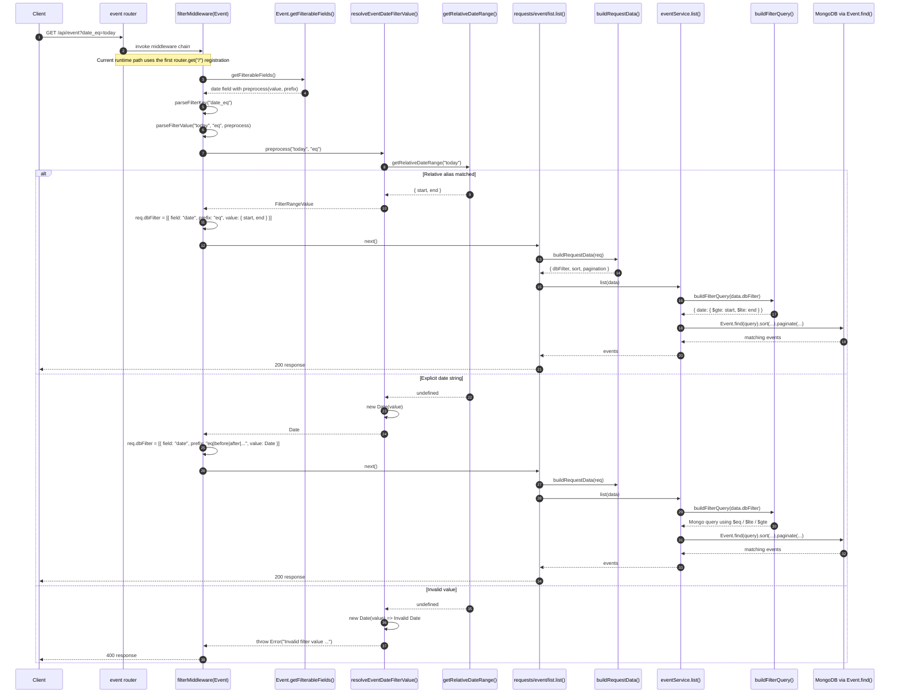

# Event Date Filter Flow

This document describes the runtime flow for event date filters on `GET /api/event`, for example:

- `GET /api/event?date_eq=today`
- `GET /api/event?date_eq=this_week`
- `GET /api/event?date_before=2026-09-21`

## Sequence Diagram



## Method Call Order

For a request like `GET /api/event?date_eq=today`, the methods are called in this order:

1. `router.get("/", [paginateMiddleware, filterMiddleware(Event)], list)` matches the request.
2. `filterMiddleware(Event)` runs and asks the model for allowed filters through `Event.getFilterableFields()`.
3. `parseFilterKey()` splits `date_eq` into:
   - field: `date`
   - operator: `eq`
4. `parseFilterValue()` validates the raw query value and calls the `date` field preprocess function from `getFilterableFields()`.
5. The preprocess function calls `resolveEventDateFilterValue(value, prefix)`.
6. `resolveEventDateFilterValue()` tries `getRelativeDateRange(value)` first.
7. If the value is a relative alias such as `today`, `this week`, `this month`, or `this weekend`, `getRelativeDateRange()` returns `{ start, end }`.
8. If the value is not a relative alias, `resolveEventDateFilterValue()` falls back to `new Date(value)`.
9. `filterMiddleware` stores the parsed filter in `req.dbFilter`.
10. `list()` builds a request DTO through `buildRequestData(req)`.
11. `eventService.list(data)` converts `req.dbFilter` into a Mongo query with `buildFilterQuery(data.dbFilter)`.
12. `buildFilterQuery()` expands date ranges like `{ start, end }` into Mongo operators:
    - `eq` => `{ $gte: start, $lte: end }`
    - `after` or `min` => `{ $gte: start }`
    - `before` or `max` => `{ $lte: end }`
13. `Event.find(query).sort(...).paginate(...)` runs against MongoDB.
14. The list handler serializes the events with `event.toJSON()` and sends the HTTP response.

## Relative Date Resolution

The relative date handling lives in `app/src/helpers/dateFilterHelper.ts`.

- `today` resolves to the current day from `00:00:00.000` through `23:59:59.999`
- `this week` resolves from Monday start through Sunday end
- `this month` resolves from the first day of the month through the last millisecond before the next month
- `this weekend` resolves from Saturday start through Sunday end
- aliases with underscores or hyphens are normalized, for example `this_week` and `this-weekend`

Internally, the helper builds an inclusive range by computing an exclusive end and then subtracting `1ms`.

## Data Shape at Each Step

Raw query string:

```txt
date_eq=today
```

`req.dbFilter` after `filterMiddleware`:

```ts
[
  {
    field: "date",
    prefix: "eq",
    value: {
      start: Date,
      end: Date
    }
  }
]
```

Mongo query after `buildFilterQuery()`:

```ts
{
  date: {
    $gte: start,
    $lte: end
  }
}
```

## Notes

- There are two `router.get("/")` registrations in `app/src/routes/event.ts`. The first one is the effective path for this flow because it handles the response and does not call `next()`, so the later `GET /` route is not reached during a normal date-filter request.
- Date filter behavior is covered by request tests, middleware tests, helper tests, and query builder tests.
